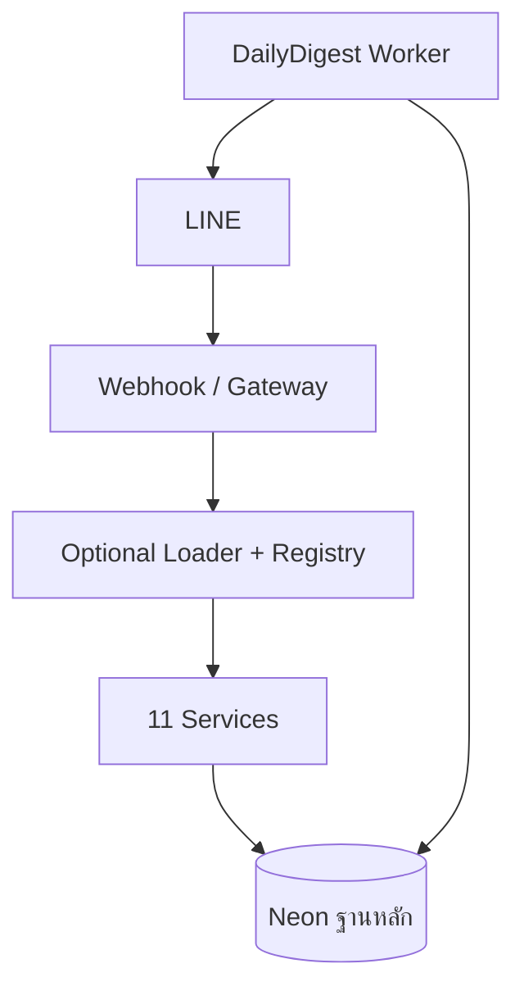

# Service Architecture v2

โปรเจกต์รุ่นนี้เริ่มใช้ interface กลาง เพื่อทยอยแยกระบบเดิมโดยไม่ทำให้คำสั่งเก่าหยุดทำงาน

## Contract กลาง

- `ServiceRequest`: ข้อมูลมาตรฐานที่ Gateway ส่งให้ทุก Service
- `ServiceResponse`: ผลลัพธ์มาตรฐาน รวมสถานะ retry และ error code
- `BotService`: interface ที่ Service ทุกตัวต้องทำตาม
- `ServiceRegistry`: ลงทะเบียน เลือก และแยกข้อผิดพลาดของ Service
- `OptionalServiceLoader`: import/สร้าง Service ทีละตัว ตัวที่หายหรือโหลดเสียจะถูกข้ามโดย Service อื่นยังเริ่มได้

## Service ที่ย้ายแล้ว

1. `news` — ดึงและแสดงข่าวแบบ plain โดยไม่พึ่ง AI
2. `stocks` — ราคาหุ้น
3. `ai_chat` — AI ถามตอบทั่วไปผ่านคำสั่ง `ถาม ...` หรือ `ai ...`
4. `conversation_memory` — ดูและล้างความจำของ AI แยกตาม chat ID
5. `group_reports` — เปิด/ปิดการบันทึก สรุป และสร้างรายงานบทสนทนากลุ่ม
6. `contacts` — ค้นหาผู้ติดต่อและรายชื่อฉุกเฉิน แยกจากคำสั่ง Admin
7. `subscriptions` — จัดการหัวข้อติดตามและสถานะข่าวประจำวันแยกตาม chat ID
8. `admin` — เพิ่ม/ตรวจ/แสดงข้อมูลฐานหลัก พร้อมตรวจสิทธิ์ผู้ใช้
9. `settings` — ดูและเปลี่ยน AI สำหรับคำสั่ง `ถาม` (`none/local/gemini/anthropic`)
10. `help` — สร้างเมนูจาก Service ที่เปิดใช้งานจริงของแต่ละ Bot
11. `unknown` — รับข้อความที่ไม่ตรงคำสั่งและแนะนำเมนู โดยไม่ส่งไปค้นข่าว

ระบบข่าวแสดงผลแบบ plain เท่านั้น และไม่เรียก AI ทั้งข่าวปกติ ข่าวจากคำค้น และข่าวประจำวัน

Contacts ใช้ `DATABASE_URL` เพียงฐานเดียว และรองรับ primary key แบบ Int autoincrement ตาม Prisma schema
แบบฟอร์มเพิ่มผู้ติดต่อรองรับ `ตัวย่อหน่วยงาน` และบันทึกลง `organizations.code`

ไม่มีคำสั่งที่ผ่าน legacy adapter แล้ว ข้อความทั้งหมดเข้าสู่ ServiceRegistry

## Process และข้อมูล



- `news.py` มีเฉพาะข่าวและไม่ import AI หรือหุ้น
- `stock.py` เป็น provider ราคาหุ้นอิสระ
- `daily_digest_worker.py` รันคนละ process กับ Webhook
- `BotStateRepository` เก็บ chat ID, subscription, topics และ settings ใน Neon โดยไม่ fallback เป็น JSON
- `ConversationRepository` เก็บคำถาม/คำตอบ และโหลด 20 ข้อความล่าสุดให้ AI
- `GroupMessageRepository` บันทึกข้อความกลุ่มเมื่อแอดมินเปิด opt-in เท่านั้น

## การกำหนดหน้าที่ต่อบอท

```env
BOT_SERVICES=news,stocks,ai_chat,conversation_memory,group_reports,contacts,subscriptions,admin,settings,help,unknown
```

ตัวอย่าง Bot ข่าวอย่างเดียว:

```env
BOT_SERVICES=news,help,unknown
```

ตัวอย่าง Bot AI อย่างเดียว:

```env
BOT_SERVICES=ai_chat,conversation_memory,settings,help,unknown
```

หากมีหลาย Bot สามารถใช้ตัวแปรเฉพาะ bot id เช่น `BOT_SERVICES_NEWS_BOT=news,help,unknown`

## หลักการแยกความเสียหาย

Loader แยกข้อผิดพลาดตอน import/สร้างแต่ละ Service ส่วน Registry จับ exception ตอนทำงานและตอบว่า
ระบบนั้นไม่พร้อมโดยไม่ทำให้ Service ถัดไปเสียตาม งานรายวันถูกแยกเป็น Worker คนละ process แล้ว
แต่ Service ทั้ง 11 ตัวใน Webhook ยังแชร์ web process เดียวกันอยู่

`HelpService` แสดงเมนูแบบ dynamic สำหรับ:

- `conversation_memory`: `ความจำ`, `ล้างความจำ`
- `group_reports`: `สรุปแชท`, `รายงานแชท`, `เปิด/ปิดบันทึกแชท`, `ล้างประวัติกลุ่ม`

รายการเหล่านี้จะแสดงเมื่อ Service นั้นเปิดใน `BOT_SERVICES` เท่านั้น
